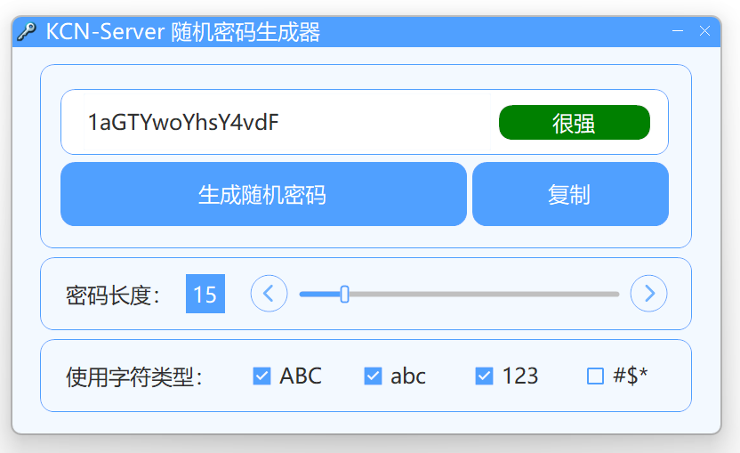

# KCNPasswordGenerator

> KCN的密码生成器小工具。

### 关于软件
- 写着玩的喵。使用.NET 8构建。
- 支持调整密码长度、支持调整使用的字符类型(大小写字母、数字、特殊符号)、支持简单的密码复杂度判断。

### 软件下载
- 开箱即用

请到最新 [Releases](https://github.com/JDDKCN/KCNPasswordGenerator/releases/) 处下载。

- 自行编译

请下载 [项目源码](https://github.com/JDDKCN/KCNPasswordGenerator/archive/refs/heads/main.zip) 自行编译，需要VS/.NET 8开发环境。

### 软件截图
- v1.0.0 2024/10/23

### 系统支持
- 支持Windows 10及更高版本系统。

### 联系方式
- [前往我的B站首页](https://space.bilibili.com/475547854/)
- [前往我的Twitter账号](https://twitter.com/2233KCN03)
- [前往我的BlueSky账号](https://bsky.app/profile/kcn.ink)